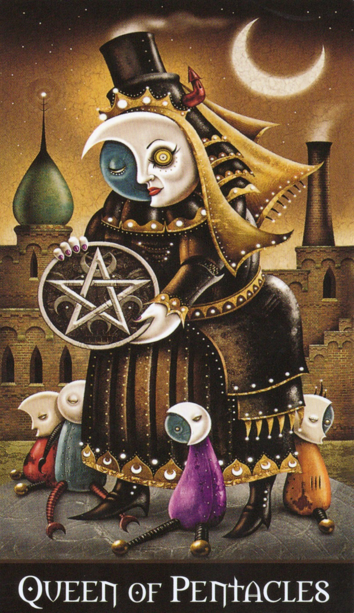

# 🌕 Healing with the Queen of Pentacles（女王と癒しのパスワーキング）

この内的ワークは、Deviant Moon Tarotの「Queen of Pentacles」を使用したドロレス・アッシュクロフト＝ノーウィッキー風のパスワーキングです。

## 🪄 概要

- 使用カード：Queen of Pentacles
- 想定：夜、静かな室内または屋外（心の空間でも可）
- 所要時間：10〜20分
- 必要なもの：静かな空間、視覚化のための集中

---

## 🔮 パスワーキング

1. **はじまりの祈り**
   - 「十字路の女神ヘカテよ。過去と現在と未来をつなぐこの時の中で、私の魂に癒しと統合をもたらしてください。」

2. **自己投影**
   - 自分が「Queen of Pentacles」となっていることを想像します。
   - 手には大きなペンタクル。夜の月光に照らされ、足元には柔らかな影が伸びています。

3. **小さき者たちの登場**
   - 足元に、小さな人物たちが現れ始めます。
   - それぞれの姿には見覚えがあります——過去の自分、未来の自分、あるいは魂の中に残る断片です。
   - ある者は悲しみ、ある者は怒り、孤独、絶望を抱えています。

4. **癒しの光**
   - ヘカテの月からアゾートの光が差し込みます。
   - あなたのペンタクルを通じて、その癒しの光が小さな存在たちに降り注がれます。
   - 「すべては終わった。癒され、解放され、帰ることができる」と心の中で語りかけます。

5. **帰還と統合**
   - 小さな者たちは安らぎ、ひとりずつ光となって霧のように溶け、自分自身へと戻っていきます。
   - 最後に、ペンタクルを胸に抱えながら、深呼吸とともに意識を現在に戻します。

---

## 🖼️ カード画像

---

## 📝 備考

- このワークは、自身の過去・現在・未来の自己を統合するための内的ワークです。
- ドロレス・アッシュクロフト＝ノーウィッキーのスタイルに倣い、構造はシンプルでありながらも深い癒しを目的としています。
- カードのイメージは儀式の補助として使用しますが、最終的には視覚化のみでも可能です。

---

## 📋 License

This work is part of the Open Source Witchcraft project.  
Distributed under Creative Commons BY-SA 4.0 License.

GitHub: https://github.com/ravensgate-tux